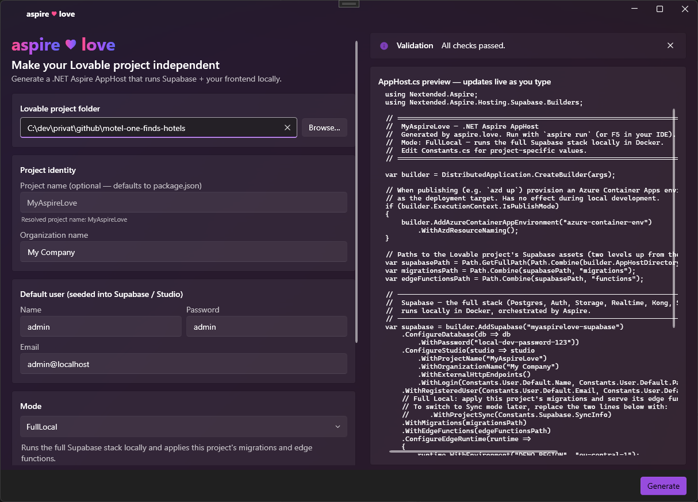

<div align="center">

# aspire&#9829;love

**Make your [Lovable](https://lovable.dev) project independent of the Lovable/Supabase cloud.**

aspire.love generates a clean **.NET Aspire AppHost** that runs your entire stack
locally — Supabase, edge functions and the Vite frontend — with a single command.
No cloud lock-in. Switch to sync or remote whenever you like.

If you like this tool please give us a star 🔆

[](https://www.nuget.org/packages/love.aspire)
[](#license)

</div>



---

## Why

A Lovable project depends on hosted Supabase and a build pipeline you don't control.
aspire.love hands that control back: it drops an `aspire` folder (a Solution + an Aspire
AppHost) into your existing project, wires up Supabase, your migrations, your edge
functions and the frontend, and lets you run the whole thing locally with `aspire run`.

The generated C# is structured and commented, so you can read it, tweak it, and switch
modes by hand at any time.

## Install

```bash
dotnet tool install -g love.aspire
```

**Prerequisites:** [.NET 10 SDK](https://dotnet.microsoft.com/download), Docker (for the
local Supabase stack) and the [.NET Aspire](https://learn.microsoft.com/dotnet/aspire/)
workload.

## Use

```bash
# generate the aspire folder into your Lovable project
aspire-love init --path ./my-lovable-app

# then run everything together
aspire run
```

Prefer a UI? The **aspire.love Studio** desktop app (WPF / Fluent) walks you through every
option with live validation and a live `AppHost.cs` preview that updates as you type.

## Modes

| Mode | What it does |
| --- | --- |
| **FullLocal** *(default)* | Runs the entire Supabase stack in Docker and applies your migrations and edge functions. Perfect for offline development. |
| **SupabaseSync** | Runs Supabase locally but pulls schema and data from an existing cloud project. Stay in sync while you build. |
| **RemoteConnect** | No local stack — the frontend talks directly to your existing Supabase cloud project. Lightweight and fast. |

Start fully local and switch later: the generated code is commented to make switching
between modes trivial.

## CLI

```bash
aspire-love init   # generate an Aspire AppHost into an existing Lovable project
aspire-love update # check for and install the latest version of aspire.love
```

### `init` options

| Option | Description | Default |
| --- | --- | --- |
| `--path`, `-p` | Path to the root of the Lovable project. | current directory |
| `--name`, `-n` | Project name. | `package.json` name, then `MyAspireLove` |
| `--organization`, `-o` | Organization name shown in Supabase Studio. | `My Company` |
| `--mode`, `-m` | `FullLocal`, `SupabaseSync` or `RemoteConnect`. | `FullLocal` |
| `--monitoring` | Add the Grafana/Tempo/OpenTelemetry stack (local modes only). | off |
| `--persistent-storage` | Persist Supabase Storage when deployed (Azure Files NFS + MinIO S3; local modes only). | off |
| `--deploy-script` | Generate a guided `scripts/deploy.ps1` for deploying to Azure with azd. | off |
| `--lovable-api-key` | Lovable AI gateway key, so the project's built-in AI keeps working locally. | — |
| `--db-password` | Local Postgres password. | `local-dev-password-123` |
| `--user-name` / `--user-email` / `--user-password` | Default admin user seeded into Supabase / Studio. | `admin` / `admin@localhost` / `admin` |
| `--dry-run` | Show what would be generated without writing any files. | off |
| `--yes`, `-y` | Proceed even if there are warnings. | off |

**SupabaseSync** adds `--sync-project-ref`, `--sync-service-key`, `--sync-db-password`,
`--sync-management-token`. **RemoteConnect** adds `--remote-project-ref`,
`--remote-service-key`.

## Features

- **CLI & desktop app** — a `dotnet tool` for the terminal and a Fluent desktop app, both
  sharing the exact same generation core.
- **Readable, commented output** — generated C# is structured and documented.
- **Observability included** — optionally wire in Grafana, Tempo and an OpenTelemetry
  collector for local traces and dashboards.
- **Lovable AI keeps working** — bring your `LOVABLE_API_KEY` and the edge runtime keeps
  your project's built-in AI features alive locally.
- **Seeded default user** — a default admin is registered in Supabase and Studio so you
  can log in immediately.
- **Azure-ready** — a Container Apps publish target is provisioned automatically, so
  deploying with `azd up` needs no extra wiring.
- **Persistent storage** *(optional)* — back Supabase Storage with an Azure Files (NFS) share
  and a MinIO S3 endpoint, so uploaded files survive container restarts when deployed.
- **One-command deploy** *(optional)* — generate a guided `scripts/deploy.ps1` that signs into
  the right Azure tenant and runs `azd`; the desktop app's Publish button runs it for you.

## Under the hood

The generated AppHost is powered by
[**Nextended.Aspire.Hosting.Supabase**](https://www.nuget.org/packages/Nextended.Aspire.Hosting.Supabase),
the open-source .NET Aspire hosting integration that makes Supabase a first-class Aspire resource.

A single `builder.AddSupabase(...)` call brings up the entire Supabase stack — Postgres, Auth,
Storage, Realtime, the Kong gateway, Studio and the edge-function runtime — as managed Aspire
resources, with a fluent API for migrations, edge functions, a seeded user, cloud sync and
observability:

```csharp
var supabase = builder.AddSupabase("supabase")
    .ConfigureStudio(s => s.WithProjectName("MyApp"))
    .WithRegisteredUser(email, password, name)
    .WithMigrations(migrationsPath)
    .WithEdgeFunctions(edgeFunctionsPath);
```

aspire.love doesn't reinvent any of this — it's the engine behind every mode. The tool simply
generates a clean, readable AppHost around the package (instead of hand-rolled Docker Compose), so
you get a real .NET solution you can read, tweak and extend with the package's own API. Observability
builds on the companion `Nextended.Aspire.Hosting.Observability` package.

## Update

```bash
aspire-love update
```

The tool also checks GitHub releases in the background and lets you know when a newer
version is available.

## Repository layout

```
src/
  AspireLove.Core/   shared generation core (options, validation, Scriban templates)
  AspireLove.Cli/    the dotnet tool (aspire-love)
  AspireLove.Wpf/    aspire.love Studio — the Fluent desktop app
tests/
  AspireLove.Core.Tests/
website/             marketing site (and the screenshot asset)
```

## Build from source

```bash
dotnet build
dotnet test
dotnet run --project src/AspireLove.Wpf   # launch the desktop app
```

## License

MIT © [Florian Gilde | gilde.org](https://gilde.org)
